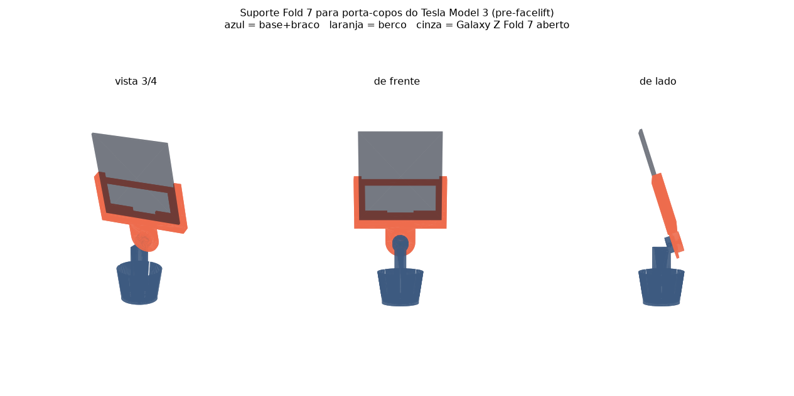

# Suporte para Galaxy Z Fold 7 aberto — Tesla Model 3 (pré-facelift)

Suporte de telemóvel que encaixa no **porta-copos da consola central** e segura um
**Samsung Galaxy Z Fold 7 desdobrado** (143,2 × 158,4 × 4,2 mm, 215 g), sem tapar
o ecrã do carro.

Para o **Model 3 pré-facelift** (o que tem alavancas atrás do volante, entregue em
Portugal até cerca de outubro de 2023). Serve também no Model Y, que tem a mesma
consola. **Não** foi feito para o Highland.



## Ficheiros

| Ficheiro | O que é | Volume |
|---|---|---|
| `stl/0_calibre_portacopos.stl` | Escada de diâmetros para medir o porta-copos **antes** de imprimir o resto | 24 cm³ |
| `stl/1_base_braco.stl` | Base de linguetas flexíveis + coluna + face estriada | 111 cm³ |
| `stl/2_berco_fold7_com_capa.stl` | Berço, ranhura de 148,2 × 8,5 mm | 91 cm³ |
| `stl/3_berco_fold7_sem_capa.stl` | Berço, ranhura de 144,6 × 5,4 mm | 82 cm³ |

Imprime **um** dos dois berços, conforme uses capa ou não.

## Ferragem

- 1 parafuso **M4 × 20** de cabeça cilíndrica (Allen de 3 mm)
- 1 porca **M4**, de preferência autoblocante

## Antes de imprimir: mede o porta-copos

As medidas do porta-copos do Model 3 que circulam online não batem certo umas com as
outras — há fontes que dizem 70 mm de diâmetro e outras 81 mm. Por isso a base tem
oito linguetas flexíveis que se comprimem e cobrem **Ø66 a Ø82**.

Imprime primeiro o `0_calibre_portacopos.stl` (cerca de 1 h). Enfia-o no porta-copos:
ele afunda até um degrau prender. O degrau de baixo é Ø66 e cada degrau acima soma
4 mm. Conta os degraus que ficam de fora para saber o teu diâmetro.

Se ficar fora do intervalo Ø66–Ø82, abre o `gerar.py`, muda `CUP_R_BOT` e `CUP_R_TOP`
e volta a correr — os STL são todos gerados por esse script.

## Impressão

**PETG. Não uses PLA** — o tablier de um carro ao sol em Portugal passa dos 60 °C e o
PLA verga. ASA ou ABS também servem.

- Camada 0,2 mm, 4 perímetros, 35 % de enchimento (gyroid)
- **Sem suportes** em nenhuma das peças
- Orientação: tal como os STL vêm. A base imprime de pé, o berço deitado de costas.
- As linguetas da base precisam de boa adesão entre camadas — imprime devagar (40 mm/s)
  e com a ventoinha a menos de 50 %.

## Montagem

1. Enfia a porca M4 no **rasgo lateral** da face estriada, no topo do braço. Fica cativa.
2. Encosta o berço ao braço, com o macho estriado dentro da fêmea. Podes escolher a
   rotação de **30 em 30 graus** — é assim que acertas o ângulo do telemóvel.
3. Aperta o M4 × 20 pela frente do cubo do berço, por baixo da prateleira.
4. Empurra a base para dentro do porta-copos até as linguetas travarem.
5. O telemóvel entra **por cima**, a deslizar pelas duas calhas, e assenta na prateleira.
   O cabo USB-C sai pelo recorte central.

## O que se regula e o que não

- **Roda no porta-copos** — para apontares ao condutor. Livre.
- **Roda no estriado** — 12 posições, de 30 em 30 graus.
- **Inclinação: fixa em 18° para trás.** Não é regulável depois de impresso. Se quiseres
  outro ângulo, muda `ARM_TILT` no `gerar.py` e reimprime só o braço. Rodar a base 180°
  no porta-copos inverte o sentido da inclinação.

## Avisos honestos

Isto foi desenhado a partir de especificações publicadas, **não** de medições no teu
carro nem no teu telemóvel. O que está verificado por cálculo: as peças são estanques,
encaixam sem colidir em qualquer das 12 posições, e o parafuso e a porca passam. O que
**não** está verificado: se assenta bem no teu porta-copos, e como se porta em estrada.

Outras coisas a contar:

- O berço agarra os **75 mm de baixo** do telemóvel. Os 83 mm de cima ficam em consola
  e vão oscilar em piso mau. É o preço de o querer aberto — 143 mm de largura não cabem
  em nenhum berço de telemóvel normal.
- Com o telemóvel montado, o topo fica a cerca de **29 cm acima do fundo do porta-copos**.
  Confirma que não te tapa a vista nem bate no apoio de braço antes de andares com ele.
- Não tem carregamento sem fios. O Fold 7 aberto não assenta em nenhum carregador Qi.

## Regenerar os STL

```bash
pip install trimesh manifold3d shapely numpy scipy networkx
python3 gerar.py          # escreve stl/
python3 previsualizar.py  # escreve previsualizacao.png
```

Todos os parâmetros estão no topo do `gerar.py`.
